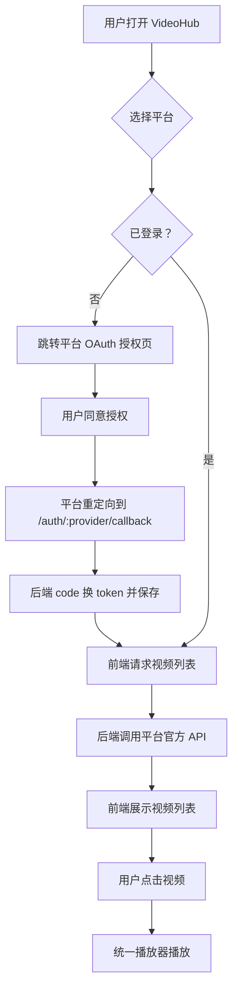

# 产品需求文档（PRD）

## 1. 产品概述

VideoHub 是一个多平台视频聚合客户端原型，目标是通过各家官方开放平台的 OAuth2 授权与视频 API，把哔哩哔哩、抖音、快手、央视网的内容统一到一个播放器中浏览与播放。用户可以在应用内分别登录不同平台的账号，随后按平台查看视频列表并播放。

> **重要前提**：本系统不绕过、不破解任何平台。完整功能依赖各平台官方开发者账号、AppKey/Secret、回调域名与 API 权限。没有凭证时，系统会退回到「演示模式」，返回模拟数据供界面验证。

## 2. 核心功能

### 2.1 用户角色

| 角色 | 注册/登录方式 | 核心权限 |
|------|---------------|----------|
| 普通用户 | 无需注册，直接通过各平台 OAuth 授权登录 | 管理已授权平台账号、浏览视频、播放视频 |

### 2.2 功能模块

1. **首页 / 平台入口**：侧边栏展示四个平台入口，显示登录状态与账号摘要。
2. **平台视频页**：按平台展示视频列表，支持刷新、分页、点击进入播放页。
3. **播放页**：统一的 HTML5 播放器，播放当前选中视频；支持播放源切换（若平台返回多清晰度）。
4. **授权回调页**：处理各平台 OAuth 回调并把 token 交给后端。
5. **设置页**：展示当前已绑定账号、解绑、手动刷新 token，以及配置模拟模式开关。

### 2.3 页面详情

| 页面 | 模块 | 功能描述 |
|------|------|----------|
| 首页 | 平台入口卡片 | 四个平台卡片，显示 logo、名称、登录状态、最近一次登录时间 |
| 首页 | 最近播放 | 展示最近点击过的视频封面与标题 |
| 平台视频页 | 视频列表 | 网格/列表展示封面、标题、时长、播放量 |
| 平台视频页 | 登录按钮 | 未登录时显示「授权登录」按钮，跳转对应平台 OAuth 页 |
| 播放页 | 播放器 | HTML5 `<video>` 播放官方 API 返回的 `play_url`，支持全屏 |
| 播放页 | 视频信息 | 标题、作者、发布时间、点赞/评论数（平台返回则有） |
| 授权回调页 | 状态提示 | 显示「授权中…」「成功」「失败」，完成后自动跳回平台页 |
| 设置页 | 账号管理 | 列出已绑定账号，提供解绑与刷新 token |
| 设置页 | 模拟模式 | 无密钥时开启，返回本地 mock 数据 |

## 3. 核心流程

用户首次打开应用后，看到四个平台入口。点击某个平台后，如果未登录，显示授权按钮；点击按钮后前端重定向到对应平台的 OAuth2 授权页。用户同意后，平台重定向回本应用回调地址，后端用 `code` 换取 `access_token` 并保存。前端随后调用后端的视频列表接口，后端根据 token 向平台官方 API 请求数据并返回给前端展示。用户点击视频进入播放页，播放器使用官方返回的播放地址进行播放。

## 4. 用户界面设计

### 4.1 设计风格

- **主题**：深色影院风格（Dark Cinematic Dashboard），主背景 `#0B0C10`，卡片背景 `#1F2833`，文字 `#C5C6C7`。
- **平台色**：哔哩哔哩 `#FB7299`、抖音 `#00F2FE`（霓虹青）、快手 `#FF6600`、央视网 `#D32F2F`。
- **按钮**：圆角 8px，hover 时带有平台色发光阴影；主要操作用实心按钮，次要用描边按钮。
- **字体**：标题使用较粗的无衬线字体（如 `Noto Sans SC` 或系统默认），正文使用常规字重；数字与英文使用 `JetBrains Mono` 增强科技感。
- **布局**：左侧固定 240px 侧边栏，右侧主内容区；播放页采用左右分栏（左侧播放器 70%，右侧信息 30%）。
- **图标**：使用 `lucide-react`，统一 20px 线框风格。

### 4.2 页面设计概览

| 页面 | 模块 | UI 元素 |
|------|------|---------|
| 首页 | 平台入口 | 四列网格卡片，hover 上浮 + 平台色边框高亮 |
| 首页 | 最近播放 | 横向滚动条，封面 16:9，带播放遮罩 |
| 平台视频页 | 顶部栏 | 平台 logo、登录状态 pill、刷新按钮 |
| 平台视频页 | 视频网格 | 响应式 3~5 列，骨架屏加载 |
| 播放页 | 播放器区 | 16:9 视频容器，深色控制条样式 |
| 播放页 | 信息区 | 标题、作者头像、统计数字、返回按钮 |
| 设置页 | 账号卡片 | 平台图标、昵称、过期时间、解绑按钮 |

### 4.3 响应式

- **桌面优先**：侧边栏常驻；视频网格 5 列。
- **平板（<=1024px）**：侧边栏可折叠为图标栏；视频网格 3 列。
- **手机（<=640px）**：底部 Tab 导航替代侧边栏；播放页全屏，信息区折叠到下方。

### 4.4 动效

- 页面加载：卡片 stagger fade-in，延迟 50ms。
- Hover：卡片 translateY(-4px) + 阴影，过渡 200ms ease-out。
- 播放页进入：视频容器从 0.95 缩放到 1，opacity 0 到 1。
- 加载状态：骨架屏 pulse 动画。
