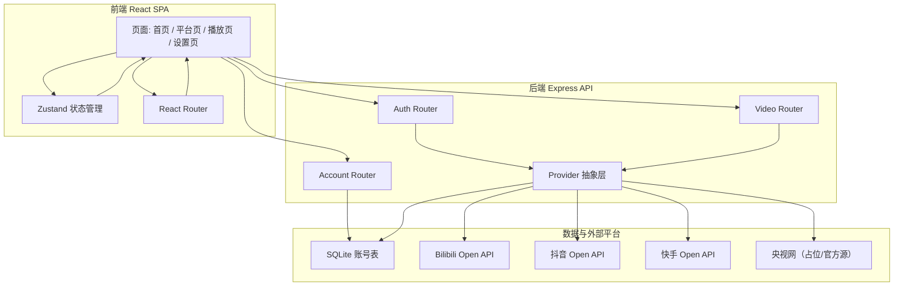
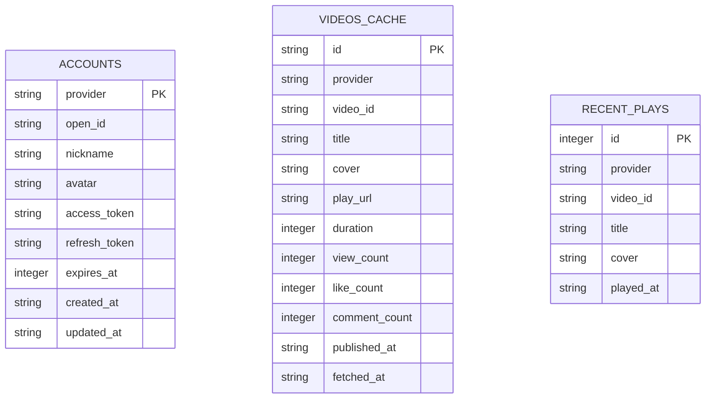

# 技术架构文档

## 1. 架构设计

系统采用前后端分离架构。前端为 React + TypeScript + Vite + Tailwind CSS 单页应用；后端为 Express + TypeScript，负责 OAuth 令牌交换、平台 API 代理、账号与视频数据缓存。后端通过「Provider 抽象层」统一不同平台的差异，便于后续扩展更多视频平台。



## 2. 技术选型

- **前端**：React 18 + TypeScript + Vite 5 + Tailwind CSS 3 + React Router 6 + Zustand + lucide-react
- **后端**：Express 4 + TypeScript + better-sqlite3（本地数据库）+ cors + dotenv
- **初始化工具**：`vite-init` 模板 `react-express-ts`
- **数据库**：SQLite，用于保存平台账号令牌、最近播放记录
- **包管理器**：优先 pnpm，否则 npm

## 3. 路由定义

### 3.1 前端路由

| 路由 | 用途 |
|------|------|
| `/` | 首页，展示平台入口与最近播放 |
| `/platform/:provider` | 指定平台的视频列表页 |
| `/watch/:provider/:videoId` | 统一播放页 |
| `/auth/:provider/callback` | OAuth 回调处理页 |
| `/settings` | 账号管理与模拟模式开关 |

### 3.2 后端路由

| 路由 | 用途 |
|------|------|
| `GET /api/health` | 健康检查 |
| `GET /api/providers` | 获取所有平台配置与登录状态 |
| `GET /api/auth/:provider/url` | 生成平台 OAuth 授权 URL |
| `GET /api/auth/:provider/callback` | 处理 OAuth 回调并保存 token |
| `POST /api/auth/:provider/refresh` | 用 refresh_token 刷新 access_token |
| `DELETE /api/auth/:provider` | 解绑当前平台账号 |
| `GET /api/videos/:provider` | 获取指定平台视频列表 |
| `GET /api/videos/:provider/:videoId` | 获取单个视频详情与播放地址 |
| `GET /api/account/:provider` | 获取已保存的账号信息 |

## 4. API 定义

### 4.1 通用响应结构

```typescript
type ApiResponse<T> = {
  success: boolean;
  data?: T;
  error?: string;
};
```

### 4.2 平台配置

```typescript
type ProviderConfig = {
  id: 'bilibili' | 'douyin' | 'kuaishou' | 'cctv';
  name: string;
  color: string;
  icon: string;
  oauthAvailable: boolean; // 是否已配置 client_id / secret
  mockAvailable: boolean;  // 是否可进入演示模式
};
```

### 4.3 账号信息

```typescript
type Account = {
  provider: string;
  openId: string;
  nickname: string;
  avatar: string;
  accessToken: string;
  refreshToken?: string;
  expiresAt: number; // 秒级时间戳
};
```

### 4.4 视频条目

```typescript
type Video = {
  id: string;
  provider: string;
  title: string;
  cover: string;
  playUrl: string;
  duration?: number;
  viewCount?: number;
  likeCount?: number;
  commentCount?: number;
  publishedAt?: string;
  author?: {
    id: string;
    name: string;
    avatar: string;
  };
};
```

## 5. Provider 抽象层

所有平台Provider实现统一接口：

```typescript
interface PlatformProvider {
  id: string;
  name: string;
  isConfigured(): boolean;
  getAuthUrl(state: string): string;
  exchangeCode(code: string): Promise<Account>;
  refreshToken(account: Account): Promise<Account>;
  listVideos(account: Account, cursor?: string): Promise<{ videos: Video[]; nextCursor?: string }>;
  getVideo(videoId: string, account: Account): Promise<Video>;
  getMockVideos(): Video[];
}
```

### 5.1 各平台实现要点

- **Bilibili**：使用官方 OAuth2 授权页 `https://account.bilibili.com/pc/account-pc/auth/oauth`，换 token 端点 `https://api.bilibili.com/x/account-oauth2/v1/token`；视频列表/详情调用官方开放接口，返回的 `play_url` 直接交给播放器。
- **抖音**：基于抖音开放平台 OAuth2，授权后调用视频相关 OpenAPI（如 `https://open.douyin.com/api/douyin/v1/video/video_data/` 等，需申请对应 scope）。
- **快手**：基于快手开放平台 OAuth2，视频列表接口 `https://open.kuaishou.com/openapi/photo/list`，需在 header/query 中携带 `access_token` 与 `app_id`。
- **央视网**：官方无公开 OAuth2 个人授权入口，本阶段作为「占位 Provider」。可配置公开直播 HLS 源（仅当用户自行提供合规源地址时），或返回演示视频数据。

## 6. 数据模型

### 6.1 ER 图



### 6.2 建表语句

```sql
CREATE TABLE IF NOT EXISTS accounts (
  provider TEXT PRIMARY KEY,
  open_id TEXT,
  nickname TEXT,
  avatar TEXT,
  access_token TEXT,
  refresh_token TEXT,
  expires_at INTEGER,
  created_at TEXT DEFAULT CURRENT_TIMESTAMP,
  updated_at TEXT DEFAULT CURRENT_TIMESTAMP
);

CREATE TABLE IF NOT EXISTS videos_cache (
  id TEXT PRIMARY KEY,
  provider TEXT NOT NULL,
  video_id TEXT NOT NULL,
  title TEXT,
  cover TEXT,
  play_url TEXT,
  duration INTEGER,
  view_count INTEGER,
  like_count INTEGER,
  comment_count INTEGER,
  published_at TEXT,
  fetched_at TEXT DEFAULT CURRENT_TIMESTAMP
);

CREATE TABLE IF NOT EXISTS recent_plays (
  id INTEGER PRIMARY KEY AUTOINCREMENT,
  provider TEXT NOT NULL,
  video_id TEXT NOT NULL,
  title TEXT,
  cover TEXT,
  played_at TEXT DEFAULT CURRENT_TIMESTAMP
);
```

## 7. 安全与合规

- 所有平台密钥、token 只保存在后端内存/数据库，不暴露到前端。
- 后端调用平台 API 时严格使用 HTTPS。
- 未配置平台密钥时自动进入「演示模式」，不发送任何外部请求。
- 用户必须自行申请各平台开发者账号与权限；本原型仅提供可配置的接入骨架。
